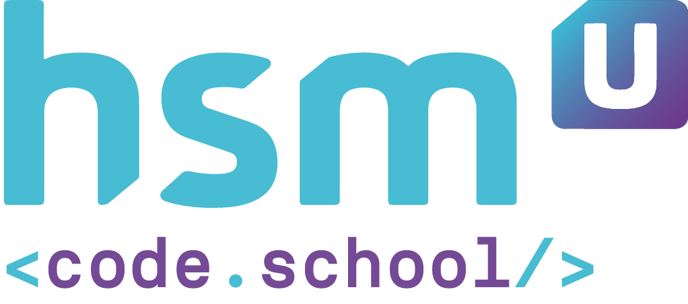

## 🚀 Atividade

Um sistema de gestão acadêmica possui a entidade Aluno, que tem características obrigatórias, como matrícula, nome, CPF, data de nascimento, sexo, nome da mãe e endereço, e opcionais, como nome do pai, e-mail e telefone.

A outra entidade é chamada Turma, que tem as seguintes características: código, nome, descrição, turno (matutino, vespertino ou noturno) e um array contendo os alunos matriculados.

Crie classes que representem essas entidades e seus principais métodos.
A classe Turma deve permitir matricular um aluno e removê-lo a partir do número de matrícula.

---

# 📚 O que eu aprendi com o projeto!

- Trabalhar com estruturas condicionais;
- Criar funções em JS;
- Concatenar váriaveis e strings;
- Aplicar eventos em elemenos;
- Chamar funções através de uma ação;
- Utilizar template string para concatenar valores.

# 💻 Tecnologias

<a href='https://www.javascript.com/'>JavaScript</a>
 
<a href='https://www.w3schools.com/html/'>HTML5</a>
 
<a href='https://www.w3schools.com/css/'>CSS3</a>
 
<a href='https://code.visualstudio.com/'>Visual Studio Code</a>
 

# 📝 Sobre o projeto

- Curso JavaScript

Este é um projeto acadêmico. Seu principal objetivo é facilitar a avaliação dos professores.

---

O aprendizado é contínuo e o próximo nível nunca será o último 🚀 by [aalvs](https://app.rocketseat.com.br/me/aalvs).